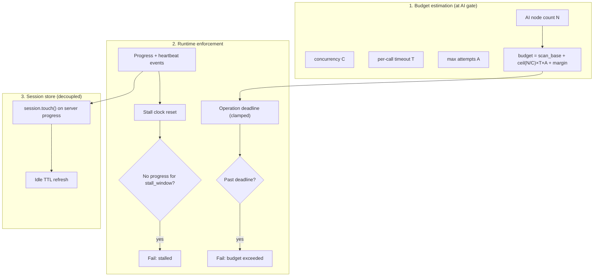

# ADR-067: Adaptive Operation Deadlines for Long AI Remediation

## Status

Proposed

## Date

2026-07-30

## Context

Large AI remediation runs (hundreds of Tier 2 candidates) routinely exceed the
current fixed **30-minute** operation window. In testing, **645** AI-candidate
violations timed out before completion. Operators should not need to tune
`APME_SESSION_TTL` or other env vars per workload.

### Current behavior (problem)

Several independent timers all default to or are derived from **1800s**:

| Layer | Location | Behavior |
|-------|----------|----------|
| gRPC `FixSession` deadline | `scan/driver.py`, `cli/remediate.py` | Hard cap on client wait |
| Session idle TTL | `daemon/session.py` (`APME_SESSION_TTL`) | Expires session when `last_activity_at` is stale |
| Session max lifetime | `daemon/session.py` (`APME_SESSION_MAX_LIFETIME`) | Absolute cap (2 h default) |
| nginx `proxy_read_timeout` | `containers/ui/nginx.conf.template` | 600s on `/api/` (WS risk) |

Additional gaps:

1. **Idle TTL is not refreshed during server work.** `session.touch()` runs
   only on client commands (`extend`, `approve`, `ai_escalate`, …). Long AI
   phases advance `last_activity_at` only at session creation, so a 45-minute
   AI fan-out expires the session even though the engine is busy.

2. **`extend` cannot run mid-processing.** `FixSession` is a single command
   loop; while `_session_process` / `_session_graph_remediate` runs, the
   servicer does not read further commands. Client `extend` is ineffective
   during the longest phase.

3. **gRPC deadline is tied to session TTL.** Gateway sets
   `timeout=APME_SESSION_TTL`, conflating “how long may this session sit idle
   between user actions” with “how long may this operation run.”

4. **No stall detection.** A hung Abbenay call, deadlock, or runaway loop
   holds the connection until the global deadline. Raising the global deadline
   to accommodate 645 fixes would force **small** jobs (5 AI candidates) to
   wait up to that same ceiling before surfacing failure.

### Workload math (why 645 fails today)

AI proposals are grouped by graph node and fetched concurrently
(`APME_AI_CONCURRENCY`, default 4). Abbenay per-call reliability timeout is
**60s**. With `max_ai_attempts=2`:

```
estimated_ai_seconds ≈ ceil(nodes / concurrency) × per_call_timeout × attempts
                     ≈ ceil(645 / 4) × 60 × 2 ≈ 19,350s  (worst case)
```

Even at a realistic **15s** average latency and one attempt:

```
≈ ceil(645 / 4) × 15 ≈ 2,418s  (~40 min)  → exceeds 30 min deadline
```

### Forces in tension

| Force | Requirement |
|-------|-------------|
| Scale | Large AI batches must complete without manual timeout tuning |
| Fail fast | Stuck operations should abort in ~10 minutes, not after a multi-hour ceiling |
| No config sprawl | Behavior must be correct out of the box |
| ADR-028 / ADR-052 | `FixSession` streaming, Gateway-owned operations, session resume |
| ADR-060 | REST contract additive only; no breaking `/api/v1` changes |

## Decision

**We will replace fixed operation timeouts with an adaptive deadline budget
computed from observable work, plus a separate stall detector that fails fast
when progress stops — independent of total budget.**

Session idle TTL and absolute max lifetime remain safety rails but are no
longer the primary operation deadline.

### Architecture



### 1. Adaptive operation budget

When the engine knows how much AI work remains (after Tier 1 exhaustion or at
`AiEscalate` / Gate 2), Primary computes an **operation budget** in seconds:

```
scan_base     = fixed overhead for format + initial scan + Tier 1 (default 300s)
ai_budget     = ceil(ai_node_count / concurrency) × per_call_timeout × max_ai_attempts
margin        = 10% of (scan_base + ai_budget), minimum 60s
raw_budget    = scan_base + ai_budget + margin
operation_budget = clamp(raw_budget, min_budget, max_budget)
```

Defaults (overridable via env for operators, not required for normal use):

| Constant | Default | Role |
|----------|---------|------|
| `min_budget` | **600s (10 min)** | Floor for tiny jobs; also used as default **stall window** |
| `max_budget` | `APME_SESSION_MAX_LIFETIME` (7200s) | Absolute operation ceiling |
| `per_call_timeout` | 60s | Matches Abbenay `reliability.timeout` |
| `concurrency` | `APME_AI_CONCURRENCY` (4) | Matches graph engine |
| `scan_base` | 300s | Non-AI pipeline overhead |

**Non-AI operations** (check, remediate without `--ai`): `operation_budget =
clamp(scan_base + tier1_margin, min_budget, max_budget)` where `tier1_margin`
scales with violation count (lightweight estimate).

The budget is attached to `SessionState` and emitted to clients:

- `SessionCreated.ttl_seconds` → renamed semantically in docs to **remaining
  operation budget** for the current phase (proto field unchanged for ADR-060).
- New `ProgressUpdate` field (additive proto): `budget_seconds` and
  `ai_completed` / `ai_total` counters during `graph-ai` phase.

### 2. Stall detection (fail fast)

Independent of `operation_budget`, Primary tracks **time since last progress
event** (including the existing 15s heartbeat, but only while a long-running
task is active).

```
stall_window = min(600s, operation_budget / 4)   # default 10 min, scales down for short budgets
```

If `now - last_progress_at > stall_window`:

- Cancel the in-flight remediate task.
- Emit `SessionEvent` error with code `operation_stalled`.
- Gateway maps to `OperationStatus.failed` with a user-visible message.

This ensures a 5-candidate job with a stuck Abbenay socket fails in ~10
minutes even if `operation_budget` would allow 30+ minutes.

### 3. Server-side session renewal

During `_session_process`, `_session_graph_remediate`, and Gate 2 AI phases:

- Call `session.touch()` on every yielded `ProgressUpdate` (including
  heartbeats while `remediate_task` is running).
- Refresh `session.operation_deadline` only at phase boundaries (not on every
  heartbeat).

Idle TTL (`APME_SESSION_TTL`) returns to its ADR-028 meaning: **time allowed
between client interactions** (approval, triage, resume), not total compute
time. Default remains 1800s.

### 4. Decouple gRPC deadlines from session TTL

| Client | Today | After |
|--------|-------|-------|
| Gateway `scan/driver.py` | `timeout=APME_SESSION_TTL` | `timeout=operation_budget + 60s` from first `SessionCreated`, or unbounded server-side with stall/deadline enforcement |
| Gateway `session_client.py` (Playground WS) | No gRPC deadline | Same budget from `SessionCreated`; rely on server stall/deadline |
| CLI `remediate` | Hardcoded 1800s | Adaptive budget from `SessionCreated.ttl_seconds`; optional `--timeout` as **override cap** |
| CLI `check` | `--timeout` default 300s | Unchanged for check; stall detection still applies |

Gateway `_drive_operation` must not cancel the gRPC task at a fixed 1800s when
the engine reports a larger budget.

### 5. Per-node AI progress

`GraphRemediationEngine._apply_ai_transforms` emits progress after **each**
completed proposal (success, abstain, or error):

```
phase=graph-ai, message="AI 142/645: node play-3/task-7", progress=142/645
```

This feeds stall detection, UI progress bars, and budget re-estimation if
`max_ai_attempts` triggers a second pass.

### 6. nginx / proxy alignment

`proxy_read_timeout` on `/api/` must be **≥ max_budget + margin** (default
≥ 7260s) or disabled for SSE/WS upgrade paths. SSE keepalive (30s) alone is
insufficient when `proxy_read_timeout` is 600s.

## Alternatives Considered

### Alternative 1: Raise global `APME_SESSION_TTL` (config-only)

**Description**: Document that large AI runs need `APME_SESSION_TTL=7200` and
higher `APME_AI_CONCURRENCY`.

**Pros**:
- No code change

**Cons**:
- Operators must discover and tune per workload
- Small stuck jobs wait hours before failing
- Conflates idle session GC with compute duration

**Why not chosen**: Does not meet “smart enough without config” requirement.

### Alternative 2: Fixed long deadline for all AI runs (e.g. 2 hours)

**Description**: Set gRPC timeout and session TTL to 7200s whenever
`enable_ai=true`.

**Pros**:
- Simple implementation

**Cons**:
- 5-candidate job with hung provider waits 2 hours
- Wastes Gateway operation registry slots and UI state

**Why not chosen**: Violates fail-fast requirement.

### Alternative 3: Background job queue with polling

**Description**: AI remediation becomes async jobs; clients poll for status.

**Pros**:
- Natural fit for very long runs

**Cons**:
- Major architectural departure from ADR-028/052 streaming model
- Duplicates operation state machinery
- Worse UX for interactive approval gates

**Why not chosen**: Disproportionate scope; adaptive streaming solves the
immediate problem.

### Alternative 4: Client-driven `extend` heartbeat during processing

**Description**: Gateway/UI sends `extend` every 5 minutes during AI.

**Pros**:
- Uses existing proto command

**Cons**:
- `FixSession` command loop does not read commands during `_session_process`
  (must be fixed regardless)
- Shifts responsibility to client; CLI and CI would each need logic

**Why not chosen**: Server-side renewal and parallel command intake are more
reliable; `extend` remains for **idle** approval waits (ADR-028).

## Consequences

### Positive

- 645-candidate runs get a budget of ~40–80 minutes (depending on concurrency)
  without operator configuration
- Stuck operations fail in ~10 minutes regardless of budget
- Session idle TTL recovers its intended semantics (pause between user actions)
- Gateway SSE and Playground WS survive long AI phases with accurate progress
- CLI `remediate` gains parity with check via optional `--timeout` cap

### Negative

- Budget estimation can be wrong if Abbenay latency is bimodal (first call slow,
  rest fast); may complete early or occasionally hit ceiling — mitigated by
  margin and `max_ai_attempts` visibility in progress
- Slightly more complex Primary session state (`operation_deadline`,
  `last_progress_at`)
- Proto additive fields require `tox -e grpc` and OpenAPI note if exposed

### Neutral

- `APME_SESSION_MAX_LIFETIME` remains the hard stop for runaway sessions
- `APME_AI_CONCURRENCY` still affects throughput and budget estimate

## Implementation Notes

### Phase 1 — Engine (Primary)

| File | Change |
|------|--------|
| `src/apme_engine/daemon/session.py` | Add `operation_budget_s`, `operation_started_at`, `last_progress_at` to `SessionState`; `touch()` on server progress helper |
| `src/apme_engine/daemon/deadline.py` (new) | `estimate_operation_budget(ai_nodes, *, concurrency, per_call_timeout, max_attempts, scan_base) -> int` and `stall_window(budget) -> int` |
| `src/apme_engine/daemon/primary_server.py` | Compute budget before AI phase; enforce deadline + stall in `_session_graph_remediate` drain loop; `session.touch()` on progress yield; cancel `remediate_task` on stall/timeout |
| `src/apme_engine/remediation/graph_engine.py` | Per-node `_progress("graph-ai", f"AI {i}/{n}: …", i/n)` in `_apply_ai_transforms` |
| `proto/apme/v1/common.proto` | Add optional `int32 budget_seconds`, `int32 ai_completed`, `int32 ai_total` to `ProgressUpdate` (additive) |

### Phase 2 — Gateway

| File | Change |
|------|--------|
| `src/apme_gateway/scan/driver.py` | Remove `_FIX_SESSION_TIMEOUT = APME_SESSION_TTL`; use budget from `SessionCreated` + slack, or omit client deadline and rely on server enforcement |
| `src/apme_gateway/session_client.py` | Same; forward `budget_seconds` / AI counters over WS |
| `src/apme_gateway/api/operation_router.py` | Map `operation_stalled` / budget exceeded to `failed` with distinct error codes |
| `containers/ui/nginx.conf.template` | `proxy_read_timeout` ≥ 7200s for `/api/` or `proxy_read_timeout 0` for SSE/WS locations |

### Phase 3 — CLI

| File | Change |
|------|--------|
| `src/apme_engine/cli/parser.py` | Add `--timeout` to `remediate` (optional cap overriding adaptive budget) |
| `src/apme_engine/cli/remediate.py` | Read `SessionCreated.ttl_seconds` as budget; `stub.FixSession(..., timeout=budget + 60)` |

### Phase 4 — Tests

| File | Change |
|------|--------|
| `tests/test_session.py` | Budget estimation unit tests; stall fires when progress stops |
| `tests/test_graph_engine.py` or remediation tests | Per-node progress callback invoked N times |
| `tests/test_scan_driver.py` | Driver does not use fixed 1800s when budget is larger |

### Enforcement loop (pseudocode)

```python
# Inside _session_graph_remediate drain loop (primary_server.py)
budget = session.operation_budget_s
stall_limit = stall_window(budget)
while not remediate_task.done():
    if monotonic() - session.operation_started_at > budget:
        remediate_task.cancel()
        yield error_event("operation_budget_exceeded")
        return
    if monotonic() - session.last_progress_at > stall_limit:
        remediate_task.cancel()
        yield error_event("operation_stalled")
        return
    update = await wait_for(progress_queue.get(), timeout=1.0)
    if update:
        session.touch()
        session.last_progress_at = monotonic()
        yield SessionEvent(progress=update)
```

### Optional follow-up (not required for initial acceptance)

- **Parallel command intake**: background task reads `extend` / `approve` while
  processing runs, unblocking ADR-028 client `extend` during idle approval
  waits that overlap with compute (Gate 2 after triage).
- **Telemetry-driven estimation**: replace static `per_call_timeout` with
  rolling p95 from recent Abbenay calls in the session.

## Invariant Consistency

| Invariant | Status |
|-----------|--------|
| 1. Validators read-only | Consistent |
| 2. gRPC between services | Consistent |
| 7. Async servers | Consistent — stall cancel uses `task.cancel()` |
| 10. FixSession sole client path | Consistent — enhances, does not replace |
| 15. tox-only verification | Consistent |

**ADR relationship**: Amends implementation of [ADR-028](ADR-028-session-based-fix-workflow.md)
session TTL semantics (idle vs compute). Compatible with
[ADR-052](ADR-052-project-operation-sse-architecture.md),
[ADR-064](ADR-064-assess-pause-session-continue.md). Does not change REST
response schemas beyond additive error codes.

## Related Decisions

- [ADR-028](ADR-028-session-based-fix-workflow.md) — `FixSession`, `extend`, session TTL
- [ADR-025](ADR-025-ai-provider-protocol.md) — AI provider abstraction
- [ADR-039](ADR-039-unified-operation-stream.md) — unified check/remediate stream
- [ADR-052](ADR-052-project-operation-sse-architecture.md) — Gateway-owned operations
- [ADR-064](ADR-064-assess-pause-session-continue.md) — assess-pause session continue
- [ADR-060](ADR-060-rest-api-versioning-contract.md) — additive API only

## References

- `docs/design/DESIGN_REMEDIATION.md` — heartbeat and progress queue design
- `docs/architecture/08-ai-remediation.md` — Tier 2 AI fan-out
- `src/apme_engine/remediation/graph_engine.py` — `_apply_ai_transforms`
- `src/apme_gateway/scan/driver.py` — `_FIX_SESSION_TIMEOUT`

---

## Revision History

| Date | Author | Change |
|------|--------|--------|
| 2026-07-30 | APME Team | Initial proposal |
