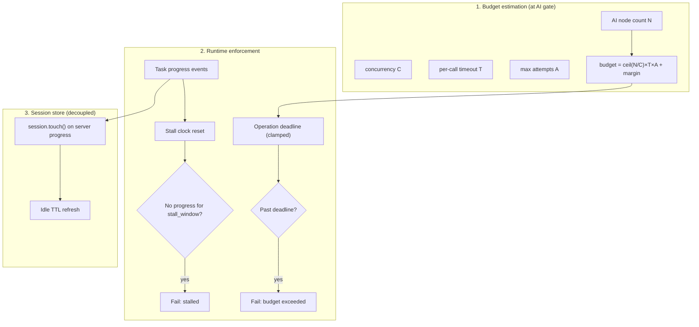

# ADR-068: Adaptive Operation Deadlines for Long AI Remediation

## Status

Implemented

## Date

2026-07-30

## Context

Large AI remediation runs (hundreds of Tier 2 candidates) routinely exceed the
current fixed **30-minute** operation window. In testing, **645** AI-candidate
violations timed out before completion. Operators should not need to tune
`APME_SESSION_TTL` or other env vars per workload.

### Current behavior (problem)

Several independent timers all default to or are derived from **1800s**:

| Layer | Location | Behavior |
|-------|----------|----------|
| gRPC `FixSession` deadline | `scan/driver.py`, `cli/remediate.py` | Hard cap on client wait |
| Session idle TTL | `daemon/session.py` (`APME_SESSION_TTL`) | Expires session when `last_activity_at` is stale |
| Session max lifetime | `daemon/session.py` (`APME_SESSION_MAX_LIFETIME`) | Absolute cap (2 h default) |
| nginx `proxy_read_timeout` | `containers/ui/nginx.conf.template` | 600s on `/api/` (WS risk) |

Additional gaps:

1. **Idle TTL is not refreshed during server work.** `session.touch()` runs
   only on client commands (`extend`, `approve`, `ai_escalate`, …). Long AI
   phases advance `last_activity_at` only at session creation, so a 45-minute
   AI fan-out expires the session even though the engine is busy.

2. **`extend` cannot run mid-processing.** `FixSession` is a single command
   loop; while `_session_process` / `_session_graph_remediate` runs, the
   servicer does not read further commands. Client `extend` is ineffective
   during the longest phase.

3. **gRPC deadline is tied to session TTL.** Gateway sets
   `timeout=APME_SESSION_TTL`, conflating “how long may this session sit idle
   between user actions” with “how long may this operation run.”

4. **No stall detection.** A hung Abbenay call, deadlock, or runaway loop
   holds the connection until the global deadline. Raising the global deadline
   to accommodate 645 fixes would force **small** jobs (5 AI candidates) to
   wait up to that same ceiling before surfacing failure.

### Workload math (why 645 fails today)

AI proposals are grouped by graph node and fetched concurrently
(`APME_AI_CONCURRENCY`, default 4). Abbenay per-call reliability timeout is
**60s**. With `max_ai_attempts=2`:

```text
estimated_ai_seconds ≈ ceil(nodes / concurrency) × per_call_timeout × attempts
                     ≈ ceil(645 / 4) × 60 × 2 ≈ 19,440s  (worst case)
```

Even at a realistic **15s** average latency and one attempt:

```text
≈ ceil(645 / 4) × 15 ≈ 2,430s  (~40.5 min)  → exceeds 30 min deadline
```

### Forces in tension

| Force | Requirement |
|-------|-------------|
| Scale | Large AI batches must complete without manual timeout tuning |
| Fail fast | Stuck operations should abort in ~10 minutes, not after a multi-hour ceiling |
| No config sprawl | Behavior must be correct out of the box |
| ADR-028 / ADR-052 | `FixSession` streaming, Gateway-owned operations, session resume |
| ADR-060 | REST contract additive only; no breaking `/api/v1` changes |

## Decision

**We will replace fixed operation timeouts with an adaptive deadline budget
computed from observable work, plus a separate stall detector that fails fast
when progress stops — independent of total budget.**

Session idle TTL and absolute max lifetime remain safety rails but are no
longer the primary operation deadline.

### Architecture



### 1. Adaptive operation budget

When the engine knows how much work remains, Primary computes an **operation
budget** in seconds. Formulas differ by phase because `operation_started_at`
anchors at phase entry (see below):

**Non-AI operations** (check, remediate without `--ai`):

```text
scan_base     = fixed overhead for format + initial scan + Tier 1 (default 300s)
tier1_margin  = scales with violation count (lightweight estimate)
margin        = 10% of (scan_base + tier1_margin), minimum 60s
raw_budget    = scan_base + tier1_margin + margin
operation_budget = clamp(raw_budget, min_budget, max_budget)
```

**AI remediate (Tier 2, at AI gate):** preamble (format, scan, Tier 1) runs
before the AI clock starts. The AI-phase budget excludes `scan_base`:

```text
ai_budget     = ceil(ai_node_count / concurrency) × per_call_timeout × max_ai_attempts
margin        = 10% of ai_budget, minimum 60s
raw_budget    = ai_budget + margin
operation_budget = clamp(raw_budget, min_budget, max_budget)
```

`estimate_operation_budget()` validates inputs before division and fails fast on
invalid operator configuration:

- `concurrency` must be **> 0**
- `per_call_timeout` must be **> 0**
- `max_ai_attempts` must be **≥ 1**

Invalid values raise a configuration error (logged, session fails with a clear
message) rather than producing `ZeroDivisionError` or nonsensical budgets.
Unit tests cover each invalid input.

**Operation deadline anchor.** `operation_started_at` is the monotonic clock
instant when the current phase's budget begins — not session creation and not
merely when `operation_budget_seconds` is emitted on the wire:

| Phase | `operation_started_at` | Budget emission |
|-------|------------------------|-----------------|
| Check / non-AI remediate | Session processing start (format + scan + Tier 1) | `SessionCreated` at session start |
| AI remediate (Tier 2) | AI gate entry (Tier 1 exhausted or `AiEscalate` accepted) | `SessionCreated` or progress event at AI gate |

The enforcement check `monotonic() - operation_started_at > operation_budget`
therefore measures only the current phase. Scan and Tier 1 preamble time does
not consume the AI budget.

At every phase anchor, Primary sets **both** `operation_started_at` and
`last_progress_at` to the same monotonic instant, and increments
`operation_generation` (a monotonic counter per session). This prevents inherited
progress timestamps from an earlier phase (e.g. a long Tier 1 pass) from
triggering a false stall when AI work begins.

**Phase-scoped progress events.** The shared progress queue may still contain
delayed events from an earlier phase. Each `ProgressUpdate` carries the
`operation_generation` active when it was emitted. The drain loop ignores events
where `update.operation_generation != session.operation_generation`, even if
`is_task_linked_progress(update)` would otherwise return true. Only events from
the current phase can reset `last_progress_at`.

**Non-AI enforcement scope.** For check and non-AI remediate,
`begin_operation_phase()` runs at the **start of `_session_process`** (before
formatting and idempotency checks). Budget and stall enforcement wrap the
**entire** non-AI path — format, scan, Tier 1, and graph remediate — not only
the `_session_graph_remediate` drain loop. A hung formatter must hit the same
deadline supervisor as Tier 1 work.

**Session lifetime cap.** `max_budget` bounds a single operation's duration, not
the session's absolute age. All enforcement comparisons use **monotonic time
only**. At session creation, Primary records:

```text
max_lifetime_deadline_mono = monotonic() + APME_SESSION_MAX_LIFETIME
```

`SessionState.created_at` remains UTC wall-clock for idle-TTL and display, but
is **not** compared directly to monotonic deadlines. If sessions are persisted
and resumed (ADR-028), re-anchor on load:

```text
remaining_lifetime = max(0, created_at + max_lifetime - utcnow())
max_lifetime_deadline_mono = monotonic() + remaining_lifetime
```

The reference `SessionStore` is in-memory and does not survive process restart;
implementations that add persistence must apply this re-anchoring so the
absolute session cap stays consistent across resume.

The effective operation deadline is:

```text
operation_deadline = min(
    operation_started_at + operation_budget,
    max_lifetime_deadline_mono,
)
```

Primary enforces this absolute deadline explicitly so a session that spends time
in scan, approval, or triage cannot receive a full `max_budget` operation that
runs past the session maximum.

Defaults (overridable via env for operators, not required for normal use):

| Constant | Default | Role |
|----------|---------|------|
| `min_budget` | **600s (10 min)** | Floor for tiny jobs |
| `default_stall_seconds` | **600s (10 min)** | Stall window cap (see §2) |
| `max_budget` | `APME_SESSION_MAX_LIFETIME` (7200s) | Absolute operation ceiling |
| `per_call_timeout` | 60s | Matches Abbenay `reliability.timeout` |
| `concurrency` | `APME_AI_CONCURRENCY` (4) | Matches graph engine |
| `scan_base` | 300s | Non-AI pipeline overhead |

The budget is attached to `SessionState` and emitted to clients:

- `SessionCreated.ttl_seconds` **unchanged** — remains session idle TTL per
  ADR-028 (not repurposed).
- New additive `SessionCreated.operation_budget_seconds` — operation deadline
  for the current phase. Emitted as soon as the budget is known (at session
  start for check/non-AI; at the AI gate for remediate with Tier 2).
- New `ProgressUpdate` fields (additive proto): `budget_seconds` (remaining
  budget), `ai_completed`, `ai_total` during `graph-ai` phase, and
  `operation_generation` (ties events to the active phase for stall detection).

**gRPC client deadline constraint.** The client opens `FixSession` **before**
any `SessionCreated` arrives on the stream. An active gRPC deadline therefore
cannot be derived from `operation_budget_seconds` on the same RPC — the budget
is learned in-stream, and non-AI budgets depend on violation counts not known
at call start. Gateway and CLI **omit the client-side gRPC deadline** for
`FixSession` remediate (and rely on server-side budget + stall enforcement).
`operation_budget_seconds` is informational for UI progress and optional
`--timeout` override caps; it does not configure the transport deadline.

### 2. Stall detection (fail fast)

Independent of `operation_budget`, Primary tracks **time since last task-linked
progress event** — not heartbeats. The existing 15s heartbeat keeps the
`FixSession` stream alive and refreshes idle TTL via `session.touch()`, but does
**not** reset the stall clock.

```text
stall_window = min(default_stall_seconds, operation_budget)   # 600s cap; scales down for short budgets
```

If `now - last_progress_at > stall_window`:

- Cancel and await the in-flight remediate task (see enforcement pseudocode).
- Emit `SessionEvent` error with code `operation_stalled`.
- Gateway maps to `OperationStatus.failed` with a user-visible message.

This ensures a 5-candidate job with a stuck Abbenay socket fails in ~10
minutes (`stall_window = min(600, operation_budget)` → 600s when
`operation_budget ≥ 600`) even if `operation_budget` would allow 30+ minutes.

### 3. Server-side session renewal

During `_session_process`, `_session_graph_remediate`, and Gate 2 AI phases:

- Call `session.touch()` on every yielded `ProgressUpdate` (including
  heartbeats while `remediate_task` is running) to refresh idle TTL.
- Update `last_progress_at` only for **task-linked** progress (phase advances,
  per-node AI completion, scan milestones) — not heartbeat-only events.

Idle TTL (`APME_SESSION_TTL`) returns to its ADR-028 meaning: **time allowed
between client interactions** (approval, triage, resume), not total compute
time. Default remains 1800s.

### 4. Decouple gRPC deadlines from session TTL

| Client | Today | After |
|--------|-------|-------|
| Gateway `scan/driver.py` | `timeout=APME_SESSION_TTL` | Omit client gRPC deadline; rely on server budget + stall enforcement |
| Gateway `session_client.py` (Playground WS) | No gRPC deadline | Same; forward `operation_budget_seconds` for UI only |
| CLI `remediate` | Hardcoded 1800s | Omit client gRPC deadline; optional `--timeout` as **override cap** enforced client-side |
| CLI `check` | `--timeout` default 300s | Unchanged for check; stall detection still applies server-side |

Gateway `_drive_operation` must not cancel the gRPC task at a fixed 1800s when
the engine is still emitting progress within budget.

### 5. Per-node AI progress

`GraphRemediationEngine._apply_ai_transforms` emits progress after **each**
completed proposal (success, abstain, or error):

```text
phase=graph-ai, message="AI 142/645: node play-3/task-7", progress=142/645
```

This feeds stall detection, UI progress bars, and budget re-estimation if
`max_ai_attempts` triggers a second pass.

### 6. nginx / proxy alignment

`proxy_read_timeout` limits the **inactivity interval between upstream reads**,
not total response lifetime. With Primary heartbeats every 15s (and Gateway SSE
keepalive every 30s) forwarded and flushed through nginx, an active long-running
stream resets the read timer on each chunk — the connection stays open for the
full operation without requiring `proxy_read_timeout` to exceed `max_budget`.

Requirements:

- SSE and WebSocket upgrade paths must **forward and flush** engine heartbeats
  (or equivalent keepalive chunks) within the configured `proxy_read_timeout`.
- Set `proxy_read_timeout` high enough for genuinely idle connections (e.g.
  approval waits with no server progress) — default **≥ 600s** on `/api/`, or
  `proxy_read_timeout 0` for dedicated SSE/WS locations.
- Do **not** assume raising `proxy_read_timeout` to `max_budget` is required
  for active streams; heartbeat forwarding is the primary long-operation
  mechanism.

## Alternatives Considered

### Alternative 1: Raise global `APME_SESSION_TTL` (config-only)

**Description**: Document that large AI runs need `APME_SESSION_TTL=7200` and
higher `APME_AI_CONCURRENCY`.

**Pros**:
- No code change

**Cons**:
- Operators must discover and tune per workload
- Small stuck jobs wait hours before failing
- Conflates idle session GC with compute duration

**Why not chosen**: Does not meet “smart enough without config” requirement.

### Alternative 2: Fixed long deadline for all AI runs (e.g. 2 hours)

**Description**: Set gRPC timeout and session TTL to 7200s whenever
`enable_ai=true`.

**Pros**:
- Simple implementation

**Cons**:
- 5-candidate job with hung provider waits 2 hours
- Wastes Gateway operation registry slots and UI state

**Why not chosen**: Violates fail-fast requirement.

### Alternative 3: Background job queue with polling

**Description**: AI remediation becomes async jobs; clients poll for status.

**Pros**:
- Natural fit for very long runs

**Cons**:
- Major architectural departure from ADR-028/052 streaming model
- Duplicates operation state machinery
- Worse UX for interactive approval gates

**Why not chosen**: Disproportionate scope; adaptive streaming solves the
immediate problem.

### Alternative 4: Client-driven `extend` heartbeat during processing

**Description**: Gateway/UI sends `extend` every 5 minutes during AI.

**Pros**:
- Uses existing proto command

**Cons**:
- `FixSession` command loop does not read commands during `_session_process`
  (must be fixed regardless)
- Shifts responsibility to client; CLI and CI would each need logic

**Why not chosen**: Server-side renewal and parallel command intake are more
reliable; `extend` remains for **idle** approval waits (ADR-028).

## Consequences

### Positive

- 645-candidate runs receive a budget capped at **120 minutes** (`max_budget` /
  `APME_SESSION_MAX_LIFETIME`); the two-attempt worst-case formula exceeds that
  ceiling and is clamped. A typical one-attempt run at ~15s average latency is
  ~40.5 minutes — both complete under adaptive budgeting without operator
  configuration
- Stuck operations fail in ~10 minutes regardless of budget
- Session idle TTL recovers its intended semantics (pause between user actions)
- Gateway SSE and Playground WS survive long AI phases with accurate progress
- CLI `remediate` gains parity with check via optional `--timeout` cap

### Negative

- Budget estimation can be wrong if Abbenay latency is bimodal (first call slow,
  rest fast); may complete early or occasionally hit ceiling — mitigated by
  margin and `max_ai_attempts` visibility in progress
- Slightly more complex Primary session state (`operation_deadline`,
  `last_progress_at`)
- Proto additive fields require `tox -e grpc` and OpenAPI note if exposed

### Neutral

- `APME_SESSION_MAX_LIFETIME` remains the hard stop for runaway sessions
- `APME_AI_CONCURRENCY` still affects throughput and budget estimate

## Implementation Notes

### Phase 1 — Engine (Primary)

| File | Change |
|------|--------|
| `src/apme_engine/daemon/session.py` | Add `operation_budget_s`, `operation_started_at`, `last_progress_at`, `operation_generation`, `max_lifetime_deadline_mono` to `SessionState`; `begin_operation_phase()` sets anchors and increments generation |
| `src/apme_engine/daemon/deadline.py` (new) | `estimate_operation_budget(...) -> int` (separate non-AI and AI formulas; validate inputs), `stall_window(budget) -> int`, `is_task_linked_progress(update, generation) -> bool` |
| `src/apme_engine/daemon/primary_server.py` | `begin_operation_phase` at `_session_process` start (non-AI); shared deadline/stall supervisor wraps full non-AI path; AI gate re-anchors and enforces in `_session_graph_remediate` drain loop |
| `src/apme_engine/remediation/graph_engine.py` | Per-node `_progress("graph-ai", f"AI {i}/{n}: …", i/n)` in `_apply_ai_transforms` |
| `proto/apme/v1/common.proto` | Add optional `int32 budget_seconds`, `int32 ai_completed`, `int32 ai_total` to `ProgressUpdate` (additive) |
| `proto/apme/v1/primary.proto` | Add optional `int32 operation_budget_seconds` to `SessionCreated` (additive); `ttl_seconds` unchanged |

### Phase 2 — Gateway

| File | Change |
|------|--------|
| `src/apme_gateway/scan/driver.py` | Remove `_FIX_SESSION_TIMEOUT = APME_SESSION_TTL`; omit client gRPC deadline; rely on server enforcement |
| `src/apme_gateway/session_client.py` | Same; forward `budget_seconds` / AI counters over WS |
| `src/apme_gateway/api/operation_router.py` | Map `operation_stalled` / budget exceeded to `failed` with distinct error codes |
| `containers/ui/nginx.conf.template` | Ensure SSE/WS paths forward heartbeats within `proxy_read_timeout`; raise timeout for idle approval waits or use `proxy_read_timeout 0` for dedicated SSE/WS locations |

### Phase 3 — CLI

| File | Change |
|------|--------|
| `src/apme_engine/cli/parser.py` | Add `--timeout` to `remediate` (optional cap overriding adaptive budget) |
| `src/apme_engine/cli/remediate.py` | Omit client gRPC deadline; optional `--timeout` override cap |

### Phase 4 — Tests

| File | Change |
|------|--------|
| `tests/test_session.py` | Budget estimation unit tests; invalid config fail-fast; stall fires when progress stops |
| `tests/test_graph_engine.py` or remediation tests | Per-node progress callback invoked N times |
| `tests/test_scan_driver.py` | Driver does not use fixed 1800s when budget is larger |

### Enforcement loop (pseudocode)

```python
# Inside _session_graph_remediate drain loop (primary_server.py)
budget = session.operation_budget_s
stall_limit = stall_window(budget)
operation_deadline = min(
    session.operation_started_at + budget,
    session.max_lifetime_deadline_mono,
)

async def _fail_remediate(code: str):
    """Cancel, await cleanup, then emit terminal error."""
    remediate_task.cancel()
    try:
        await remediate_task
    except CancelledError:
        pass
    except Exception:
        logger.exception("remediate_task cleanup failed after %s", code)
    yield error_event(code)

while not remediate_task.done():
    now = monotonic()
    if now > operation_deadline:
        async for evt in _fail_remediate("operation_budget_exceeded"):
            yield evt
        return
    if now - session.last_progress_at > stall_limit:
        async for evt in _fail_remediate("operation_stalled"):
            yield evt
        return
    try:
        update = await wait_for(progress_queue.get(), timeout=1.0)
    except TimeoutError:
        continue  # no event this tick; re-check budget/stall
    if update is None:
        continue
    session.touch()  # idle TTL refresh (heartbeats included)
    if (
        update.operation_generation == session.operation_generation
        and is_task_linked_progress(update)
    ):
        session.last_progress_at = monotonic()
    yield SessionEvent(progress=update)

# Phase anchor (called at _session_process start and AI gate entry):
def begin_operation_phase(session: SessionState, budget_s: int) -> None:
    now = monotonic()
    session.operation_budget_s = budget_s
    session.operation_started_at = now
    session.last_progress_at = now  # same instant — prevents false stall
    session.operation_generation += 1
```

### Optional follow-up (not required for initial acceptance)

- **Parallel command intake**: background task reads `extend` / `approve` while
  processing runs, unblocking ADR-028 client `extend` during idle approval
  waits that overlap with compute (Gate 2 after triage).
- **Telemetry-driven estimation**: replace static `per_call_timeout` with
  rolling p95 from recent Abbenay calls in the session.

## Invariant Consistency

| Invariant | Status |
|-----------|--------|
| 1. Validators read-only | Consistent |
| 2. gRPC between services | Consistent |
| 7. Async servers | Consistent — stall cancel uses `task.cancel()` |
| 10. FixSession sole client path | Consistent — enhances, does not replace |
| 15. tox-only verification | Consistent |

**ADR relationship**: Amends implementation of [ADR-028](ADR-028-session-based-fix-workflow.md)
session TTL semantics (idle vs compute). Compatible with
[ADR-052](ADR-052-project-operation-sse-architecture.md),
[ADR-064](ADR-064-assess-pause-session-continue.md). Does not change REST
response schemas beyond additive error codes.

## Related Decisions

- [ADR-028](ADR-028-session-based-fix-workflow.md) — `FixSession`, `extend`, session TTL
- [ADR-025](ADR-025-ai-provider-protocol.md) — AI provider abstraction
- [ADR-039](ADR-039-unified-operation-stream.md) — unified check/remediate stream
- [ADR-052](ADR-052-project-operation-sse-architecture.md) — Gateway-owned operations
- [ADR-064](ADR-064-assess-pause-session-continue.md) — assess-pause session continue
- [ADR-060](ADR-060-rest-api-versioning-contract.md) — additive API only

## References

- `docs/design/DESIGN_REMEDIATION.md` — heartbeat and progress queue design
- `docs/architecture/08-ai-remediation.md` — Tier 2 AI fan-out
- `src/apme_engine/remediation/graph_engine.py` — `_apply_ai_transforms`
- `src/apme_gateway/scan/driver.py` — `_FIX_SESSION_TIMEOUT`

---

## Revision History

| Date | Author | Change |
|------|--------|--------|
| 2026-07-30 | APME Team | Initial proposal |
| 2026-07-30 | APME Team | Renumber to ADR-068; address review (math, stall formula, budget transport, heartbeat stall semantics) |
| 2026-07-31 | APME Team | Clarify operation_started_at anchor, session lifetime cap, nginx inactivity timeout, consequence estimate |
| 2026-07-31 | APME Team | Split AI/non-AI budgets, monotonic lifetime cap, omit response-derived gRPC deadlines, phase progress init, cancel+await pseudocode |
| 2026-07-31 | APME Team | Budget input validation, phase-scoped progress events, full non-AI enforcement scope, robust cancel cleanup |
