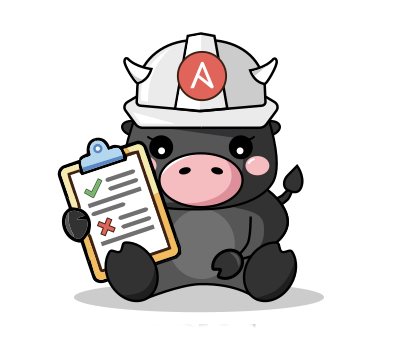

<p align="center">
  
</p>

# Ansible Forward (APME Engine)

[](https://opensource.org/licenses/Apache-2.0)

Ansible Policy & Modernization Engine — a multi-validator static analysis platform for Ansible content. It parses playbooks, roles, collections, and task files into a structured hierarchy, then fans validation out in parallel across independent backends to produce a single, unified list of violations.

## What APME is

APME is a **multi-validator static and semi-static analysis platform** for Ansible content. It parses YAML once, fans validation out across independent backends (policy, modernization, secrets, dependency health, and more), and can remediate findings — without running tasks or executing against target hosts.

It answers questions like:

- Will this playbook **parse** on ansible-core 2.19?
- Are any modules I use **removed, deprecated, or redirected**?
- Do my module arguments **match the argspec** for the version I'm targeting?
- Does my code follow **organizational style and security policies**?
- Are there **hardcoded credentials** in my project?
- What **migration work** is required to move from one ansible-core version to another?

## What APME is not

APME is not a test framework, a deployment tool, or a runtime verification system.

It cannot tell you whether a playbook will **achieve its desired outcome** on your infrastructure — that depends on target host state, inventory variables, network reachability, and runtime facts that only exist during execution. A clean APME scan means no *known* incompatibilities were detected — not that every runtime path will succeed.

**What still requires execution-time tools:**

| Concern | Tool |
|---------|------|
| Does the playbook produce the correct end state? | Molecule, integration tests |
| Is the playbook idempotent? | `--check` mode, Molecule |
| Do templates render correctly with real variables? | Integration tests |
| Does it work with my specific inventory and vault? | Staging dry-run |

APME and these tools are complementary. APME runs in seconds without infrastructure; execution-time tools validate behavior against real systems. Use both.

## Can I replace ansible-lint today?

**Not today.** Keep using [ansible-lint](https://github.com/ansible/ansible-lint) for day-to-day style and best-practice linting in local and CI workflows. APME is not a drop-in replacement.

APME's current focus is the **hosted service** experience and getting **rules, remediation, and AI escalation** right — not becoming a substitute for ansible-lint. Deeper GitHub Actions and IDE integration may come later; treat that as aspirational, not a commitment.

The first wave of APME's lint-style rules was informed by a close look at ansible-lint's rule set. APME reimplements those checks itself (it does not run ansible-lint as a subprocess). See [rule coverage vs ansible-lint](docs/rules/ANSIBLELINT_COVERAGE.md) for the matrix.

If you already run ansible-lint, keep it. Evaluate APME for modernization, organizational policy, secrets, dependency health, remediation, and the service path — and revisit whether anything can consolidate later, when the product and integrations warrant it.

## Where APME fits

APME provides a **compatibility and quality floor**. It catches the preventable mistakes — the removed module, the broken `include:`, the wrong argument name, the committed secret — before they reach staging or production.

| When discovered | Cost |
|----------------|------|
| APME scan in CI | Developer fixes it in their branch |
| Syntax check in staging | Deployment blocked, team context-switches |
| Production run fails | Outage, incident response, postmortem |

For organizations managing hundreds of roles and collections across ansible-core version upgrades, this shift-left is the difference between a planned migration and an emergency one.

## Key features

- **Single parse, multiple validators** — parse once, fan out to independent backends
- **Parallel validation** — Native (Python), OPA (Rego), Ansible (runtime), Gitleaks (secrets), Collection Health, and Dependency Audit run concurrently; latency = max, not sum
- **100+ rules** — lint (L), modernize (M), risk (R), policy (P), and secrets (SEC) categories
- **Secret scanning** — 800+ patterns via Gitleaks with vault/Jinja filtering
- **Dependency health** — collection quality checks + Python CVE audit via pip-audit
- **Multi ansible-core version support** — session-scoped venvs per target version
- **Automated remediation** — deterministic Tier 1 transforms with multi-pass convergence
- **AI-assisted fixes** — optional Tier 2 escalation via [Abbenay](https://github.com/redhat-developer/abbenay) for violations without deterministic transforms
- **YAML formatter** — normalize indentation, key ordering, Jinja spacing with comment preservation
- **Structured diagnostics** — per-rule timing data (`-v` summary, `-vv` full breakdown)
- **Unified gRPC contract** — adding a validator means implementing both `Validate` and `Health` RPCs

## Architecture at a glance

```text
┌─────────┐      gRPC       ┌────────────┐      gRPC (parallel)      ┌────────────┐
│   CLI   │ ──────────────► │  Engine    │ ──────────────────────►   │   Native   │
│         │                 │ (orchestr) │                           │    OPA     │
└─────────┘                 │            │                           │  Ansible   │
                            │  parse →   │                           │  Gitleaks  │
                            │  annotate →│                           │  Coll.Hlth │
                            │  fan-out   │                           │  Dep.Audit │
                            └─────┬──────┘                           └────────────┘
                                  │
                            ┌─────┴─────┐
                            │  Galaxy   │
                            │  Proxy    │ (PEP 503)
                            └───────────┘
```

Validator fan-out uses gRPC; Galaxy Proxy is HTTP (PEP 503). The engine parses content once, then validators consume the hierarchy independently and in parallel. See the [architecture series](docs/architecture/) for the full pipeline walkthrough.

## Getting started

| Method | Best for | Guide |
|--------|----------|-------|
| **CLI** (`pip install`) | Quick evaluation, CI pipelines, single-user | [CLI Guide](docs/guides/CLI.md) |
| **Podman pod** | Development, full feature set (UI, AI, persistence) | [Deployment Guide](docs/guides/DEPLOYMENT.md) |
| **bootc VM** | Production single-node, atomic upgrades, systemd lifecycle | [bootc Guide](deploy/bootc/README.md) |
| **APME Operator** | Kubernetes / OpenShift production | [apme-operator](https://github.com/ansible/apme-operator) |

### Try it now

```bash
pip install apme-engine@git+https://github.com/ansible/apme.git@v2026.8.2
apme check /path/to/your/project
```

CLI package tags (PyPI / git tags such as `v2026.8.2`) and container image
tags are **independent release channels** — pin each channel explicitly for your
environment. Kubernetes deployments use the [APME Operator](https://github.com/ansible/apme-operator).

The CLI automatically starts a local daemon with core validators (Native, OPA, Ansible) and Galaxy Proxy — no full pod required. The OPA validator gRPC server is always started; policy evaluation uses Podman by default (`OPA_USE_PODMAN=1`) or a local `opa` binary when `OPA_USE_PODMAN=0`. Optional validators (Gitleaks, Collection Health, Dep Audit) are not started by
default; pass `include_optional=True` to `start_daemon()` (or
`apme daemon start --include-optional`) to start them. See the
[CLI Guide](docs/guides/CLI.md) for full usage, CI integration, and limitations
compared to deployment methods.

### Remediation

```bash
# Deterministic transforms (Tier 1)
apme remediate /path/to/project

# Include AI-assisted fixes (Tier 2, requires Abbenay)
apme remediate --ai /path/to/project
```

## Project layout

```
proto/                  gRPC protobuf definitions (.proto files)
src/apme/v1/           Generated Python gRPC stubs (do not edit by hand)
src/apme_engine/
  ├── cli/              CLI (check, format, remediate, health-check, sbom, suppress)
  ├── engine/           Project loader (parse, annotate, hierarchy, graph)
  ├── validators/       Rule implementations (native/, opa/, ansible/, gitleaks/, collection_health/, dep_audit/)
  ├── daemon/           gRPC server implementations
  ├── remediation/      Tier 1 transforms + AI escalation
  └── venv_manager/     Session-scoped venv lifecycle
src/apme_gateway/       API gateway (FastAPI, REST/WebSocket, PostgreSQL)
src/galaxy_proxy/       Galaxy → PEP 503 wheel proxy
frontend/               React operator UI (Vite + TypeScript)
deploy/                 bootc VM image definitions
containers/             Containerfiles + Podman pod config
docs/                   Architecture, design, guides, rule reference
```

## Documentation

| Document | Description |
|----------|-------------|
| [CLI Guide](docs/guides/CLI.md) | Installation, commands, daemon mode, CI usage, limitations |
| [Deployment Guide](docs/guides/DEPLOYMENT.md) | Podman, bootc, operator, and CLI daemon deployment |
| [bootc Deployment](deploy/bootc/README.md) | Atomic VM image with systemd quadlets |
| [APME Operator](https://github.com/ansible/apme-operator) | Kubernetes/OpenShift deployment |
| [Architecture series](docs/architecture/) | Pipeline walkthrough, container topology, gRPC contracts, scaling |
| [Design docs](docs/design/) | Remediation engine, AI escalation, validator abstraction |
| [Rule reference](docs/rules/) | Rule catalog, ID mapping, ansible-lint coverage |
| [Development guide](docs/guides/DEVELOPMENT.md) | Local setup, tox environments, testing |
| [ADRs](.sdlc/adrs/) | Architecture Decision Records |

## Contributing

See [CONTRIBUTING.md](CONTRIBUTING.md) for development workflow, coding standards, and PR process.

## License

Apache-2.0
